# UML diagrams

This UML diagram is 🚧 work in progress 🚧

## Main Game class

## The play area

Each player's play area is modeled as a grid of `CardPlacement`s.

## Cards and their components

Every card has two faces: a front and a back.

Both sides may have:

- sockets placed at their corners
    - each socket may contain a resource
- a minimum amount of resources that are needed in order to be able to place the card
- some points that may be earned when the card is places
    - some cards give a fixed number of points
    - some cards give a number of points for each resource of a certain type on the `PlayArea`
    - some cards give a number of points for each other card that they are placed over

```mermaid
classDiagram
    class Card {
        - CardColor baseColor
        - boolean isStarter
        - boolean isGold
        - FrontCardFace front
        - BackCardFace back

        + color() CardColor
        + isStarter() boolean
        + isGold() boolean
        + getFace(Side s) CardFace

        %% TODO: add a way to get the corresponding image path
    }

    class CardColor {
        <<enumeration>>
        🔴 RED
        🟢 GREEN
        🔵 BLUE
        🟣 PURPLE

        %% ASK: keep neutral or add Optional<> inside Card ?
        ⚪ NEUTRAL
    }
```

```mermaid
classDiagram
    class CornerPosition {
        <<enumeration>>
        TOP_RIGHT
        TOP_LEFT
        BOTTOM_LEFT
        BOTTOM_RIGHT
    }
    
    note for Corner "!isSocket() ==> getCollectible().isEmpty()"
    class Corner {
        - socket boolean
        - Optional~Collectible~ collectible

        + missing()$ Corner
        + empty()$ Corner
        + filled(Collectible collectible)$ Corner

        - Corner(boolean isSocket, Optional~Collectible~)
        + isSocket() boolean
        + getCollectible() Optional~Collectible~
    }

    class Collectible {
        <<sealed interface>>
    }

    Collectible <|.. Resource : implements
    class Resource {
        <<enumeration>>
        🍃 PLANT
        🍄 FUNGI
        🦊 ANIMAL
        🦋 INSECT

        + getAssociatedColor() CardColor
    }

    Collectible <|.. Item : implements
    class Item {
        🪶 QUILL
        🫙 INKWELL
        📜 MANUSCRIPT
    }
```

Some cards cannot be placed until a certain number of resources are available on the `PlayArea`.

Some cards give points when the player places them

## Objectives

Objectives are calculated at the end of the game.
If the condition for the objective has been met, it gives points.

